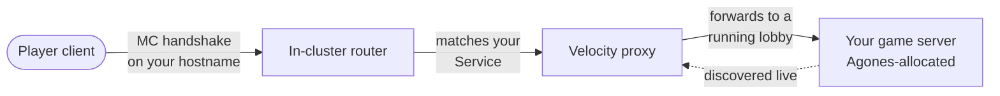

When you push a Minecraft workload, it comes with a hostname a player can connect to. This page covers what that hostname is, what sits between the player and your game logic, and how the same idea works for HTTPS `service` workloads.

For what your gamemode actually becomes at runtime, see [Game servers](/build/concepts/game-servers). For which hostname a push lands on, see [Targets](/build/concepts/targets).

## The hostname you get

Every push gives you a hostname based on the workload name in your `grounds.yaml` and where it was deployed.

| Workload | Target | Hostname |
|---|---|---|
| Minecraft (`plugin-paper`, `gamemode`, proxy) | `dev` | `<name>-<handle>.mc.grnds.io` |
| Minecraft | `staging` | `<name>-pr<id>.mc.grnds.io` |
| `service` (HTTPS) | `dev` | `<name>-<handle>.dev.grnds.io` |
| `service` (HTTPS) | `staging` | `<name>-pr<id>.dev.grnds.io` |

`<handle>` is your account handle, `<id>` is the [preview environment](/build/concepts/preview-environments) short ID. Minecraft hosts are covered by a wildcard `*.mc.grnds.io` certificate; HTTPS service hosts by `*.dev.grnds.io`. You don't register DNS or request a certificate — the hostname exists as soon as the push is ready.

A `dev` push is connectable only by you. A `staging` push is public, so it's the one to hand to a teammate. See [Targets](/build/concepts/targets) for the full visibility rules.

## The player path

For a Minecraft connection, the player types your hostname and their client lands inside the cluster, where a Velocity proxy forwards them to one of your running game servers.

The pieces you care about:

- **Routing in.** An in-cluster router reads the hostname out of the Minecraft handshake and sends the connection to the Service that owns that hostname. One hostname maps to one Service — this is what lets every push have its own host without a separate load balancer. (It matches the `mc-router.itzg.me/externalServerName` annotation forge stamps for you; you never set it by hand.)
- **The Velocity proxy.** When your gamemode runs behind a proxy, the proxy is what players actually connect to. It discovers your live game servers through the cluster automatically — there's no static server list to maintain — and forwards each player to one.
- **Your game server.** Velocity hands the player to a running server. For a gamemode, that's an Agones-allocated server from your fleet; see [Game servers](/build/concepts/game-servers) for how readiness and allocation work.

<Note>
The Anycast edge that fronts production proxies (GeoIP, nearest-region routing) is **not** on the `dev` or `staging` path. Those pushes reach Velocity through the in-cluster router directly. You don't need to think about the edge while iterating.
</Note>

## Lobbies and login routing

When a player connects through a proxy, routing behaviour is driven by lobbies:

- At least one **lobby** server must be running, or new logins are **denied** at the proxy. A gamemode fleet with zero ready servers means no one can get in.
- A new login is sent to the first available lobby. From there your own plugin logic moves the player on (into a match, a queue, wherever).
- A server's role (`lobby`, `game`, `match`) is set by the base image, not by you. Most gamemode developers never touch it.

<Tip>
"Login denied" almost always means no lobby is in a running state. Check that your fleet has at least one ready server before assuming a routing bug — `grounds logs deployment <name>` shows the server coming up.
</Tip>

## HTTPS service workloads

A `service`-type workload isn't on the Minecraft path at all. It's exposed over plain HTTPS through standard ingress:

- `dev`: `https://<name>-<handle>.dev.grnds.io`
- `staging`: `https://<name>-pr<id>.dev.grnds.io`

Push an HTTP server on port `8080`, and you get a public `https://` URL with a managed certificate — no proxy, no Velocity, no lobby logic. This is the supported way to ship a self-contained backend HTTP app today.

<Warning>
A first-class **domain service that other apps discover and call** (registered gRPC, method-level access control) is in progress and not yet pushable through the supported flow — that work is platform-deployed today. You can reach your own service at its own URL now; cross-app service calls are roadmap. Don't design around them yet.
</Warning>

## What's still WIP

Be aware of which routing modes are real today:

<AccordionGroup>
<Accordion title="Direct gamemode URL (not wired)">
Connecting straight to a gamemode's own `mc.grnds.io` hostname, bypassing a Velocity proxy, is a separate mode that isn't wired into the platform. A gamemode placed behind a proxy is reachable **through the proxy host only**.
</Accordion>

<Accordion title="Per-fleet and multi-fleet routing (not a developer-facing knob)">
Routing today goes through the standard proxy discovery described above — one push, one proxy host. Per-fleet hostnames and multi-fleet routing for advanced topologies aren't something you configure or rely on yet.
</Accordion>

<Accordion title="Service host not resolving">
Pushing a `service` workload and getting a public `https://<name>-<handle>.dev.grnds.io` URL works today — the wildcard host, ingress, and certificate are wired for you. If a host you expect doesn't come up after the push reports ready, raise it in `#grounds-platform`.
</Accordion>
</AccordionGroup>

## Related

<CardGroup cols={2}>
<Card title="Game servers" icon="gamepad" href="/build/concepts/game-servers">
What your gamemode push becomes — an Agones-managed group of servers — and how readiness drives routing.
</Card>
<Card title="Targets" icon="bullseye" href="/build/concepts/targets">
Which hostname and visibility you get for dev, staging, and production.
</Card>
<Card title="Preview environments" icon="flask" href="/build/concepts/preview-environments">
The public `pr<id>` hostnames every staging push creates.
</Card>
<Card title="Quickstart" icon="rocket" href="/build/quickstart">
Push your first server and connect to it.
</Card>
</CardGroup>
