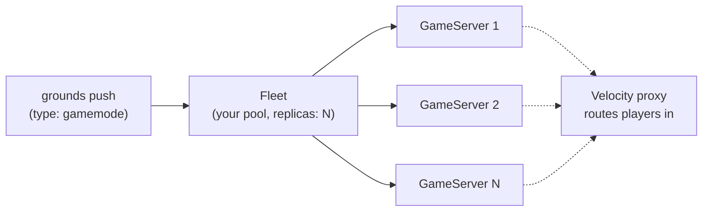

When you push an app with `type: gamemode`, you don't get a single long-lived Minecraft server. You get a **pool of identical Minecraft servers** that the platform keeps warm, scales to a replica count you choose, and marks busy or free based on whether real players are inside them. The system underneath is [Agones](https://agones.dev), but you never write Agones config — you set one field in `grounds.yaml` and the platform does the rest.

This page explains what your push turns into, the small set of knobs you control, and how a busy/free lifecycle is driven by actual player activity. For the manifest field details, see [the manifest reference](/build/manifest). For installing and configuring the plugin your server embeds, see the [Agones plugin reference](/reference/plugins/agones).

<Info>
This is for `type: gamemode` apps only. A `plugin-paper`, `plugin-velocity`, or `service` push
runs as an ordinary single workload, not a scaled pool. Only `gamemode` apps become an
Agones-managed fleet.
</Info>

## What your push becomes

A `gamemode` push produces two things you should know by name, because they show up in logs and in the portal:

<CardGroup cols={2}>
<Card title="Fleet" icon="layer-group">
  The **pool** of identical game servers, as a whole. This is the thing you control. You declare how
  many servers you want kept ready, and the platform maintains that count and rolls the whole pool
  on each re-push.
</Card>
<Card title="GameServer" icon="cube">
  **One** Minecraft server in the pool, with a busy/free state. You don't create or delete these —
  the platform spawns one per replica and replaces them as needed. You'll see them as the individual
  pods behind your gamemode.
</Card>
</CardGroup>

The mental model: **you manage the Fleet (the pool); the platform manages the individual GameServers (the members).** You never touch a GameServer directly. You set a replica count on the Fleet, and the platform keeps that many servers warm and ready for the next match.



Each server in the pool runs a Grounds gamemode base image that already bundles `plugin-agones`. That plugin is what reports each server's busy/free state and what lets the Velocity proxy discover your servers and route players to them — you don't wire any of that.

## What you control

Everything you control lives in your `grounds.yaml`. There are exactly two relevant fields, and neither requires any Kubernetes knowledge.

```yaml grounds.yaml
name: my-minigame
type: gamemode
baseImage: paper-gamemode
jar: build/libs/my-minigame-0.1.0.jar
agones:
  replicas: 3
```

| Field | What it does |
|---|---|
| `type: gamemode` | Tells the platform to run your app as a scaled, Agones-managed pool instead of a single server. |
| `agones.replicas` | How many servers the platform keeps **ready** at once. Defaults to `1`. Allowed range is `1`–`20`. |

Set `replicas` to how many simultaneous matches (or lobbies) you want capacity for. Raise it when one server can't hold the player count you need; values above 20 require a platform-side quota bump. See [`agones` in the manifest reference](/build/manifest#agones-optional-gamemode-only) for the field definition.

<Note>
The replica count is the number of servers kept **ready and warm**, not a hard player cap. Players
land on a ready server, that server flips to busy, and the platform keeps spinning the pool back up
to your replica count so there's always a free server for the next match.
</Note>

Everything else — the SDK sidecar, the busy/free state machine, the discovery wiring, the network MTU fix — is injected and managed for you. There is no Fleet YAML to write and no Kubernetes resource to edit.

## Ready and Allocated: real players drive it

Each server in your pool is always in one of two states that matter to you:

<CardGroup cols={2}>
<Card title="Ready" icon="circle-check">
  Empty and available. The platform keeps a target number of `Ready` servers warm so a joining
  player always has somewhere to land.
</Card>
<Card title="Allocated" icon="users">
  In use. At least one player is on it. An `Allocated` server is protected — the platform won't reap
  it out from under an active match.
</Card>
</CardGroup>

What flips a server between these states is **actual player activity** — not a timer, a health check, or anything you call:

<AccordionGroup>
<Accordion title="A server boots → Ready (or Allocated if it restarted with players)">
  When a fresh server comes up empty, it reports `Ready`. If a server restarts while players are
  already connected, it converges straight to `Allocated` so it isn't treated as free.
</Accordion>
<Accordion title="First player joins → Allocated">
  The moment a server goes from zero players to one, `plugin-agones` marks it `Allocated`. The
  platform now treats it as in-use and protected.
</Accordion>
<Accordion title="Last player leaves → Ready">
  When the final player disconnects, the server reports `Ready` again — empty and available for the
  next match.
</Accordion>
<Accordion title="A safety loop reconciles every few seconds">
  A background loop re-reads the live player count and corrects the state if any join/leave event was
  missed. It is not instantaneous, but it keeps a server's state honest under normal minigame load.
</Accordion>
</AccordionGroup>

The practical takeaway: **you don't manage occupancy.** Your gamemode plugin handles game logic; the bundled `plugin-agones` translates "are there players on this server" into the busy/free state, and the platform uses that to keep the pool healthy and route new players onto free servers.

<Tip>
You can watch your servers flip between `Ready` and `Allocated` as players join and leave from the
deployment's logs — `grounds logs deployment <name>` — or the deployment detail page in the portal.
</Tip>

## Bases and the pinned Minecraft version

A gamemode runs on a Grounds base image that already bundles `plugin-agones` plus the platform runtime plugins. You select it by key in `grounds.yaml`; you don't assemble it.

| Base key | For | Bundles |
|---|---|---|
| `paper-gamemode` | Paper-based gamemode servers (the common case) | `plugin-agones-paper`, so each server reports `Ready`/`Allocated` automatically |
| `velocity` | The proxy that sits in front of gamemodes and routes players | `plugin-agones-velocity` for server discovery |

<Warning>
**The Minecraft version is pinned, and it's pinned on purpose.** Every gamemode server and the
Velocity proxy in front of it must speak the same Minecraft protocol version. If the proxy lagged
behind the game servers, modern clients would be rejected with `Incompatible client`. The base
images move the Paper and Velocity versions together so they always match — this is a platform
concern, not something you set per app. Pick the base key; don't try to pin a Minecraft version
yourself.
</Warning>

<Note>
The server port is always `25565/TCP`. Custom Minecraft ports are not supported, and there are no
UDP ports. You don't configure the port.
</Note>

For the image-level details of each base, see the [Paper container](/deploy/containers/paper) and [Velocity container](/deploy/containers/velocity) references.

## How players reach your servers

Players never connect to a GameServer directly. A Velocity proxy sits in front of your pool, discovers your servers automatically, and forwards joining players onto a `Ready` one. The same `plugin-agones` that reports busy/free state on your game servers also powers discovery on the proxy — so when you push a gamemode and set a replica count, routing is wired for you.

There is one hard requirement to be aware of: **at least one lobby server must be running**, or the proxy rejects new logins. The full story — how the proxy discovers servers, how lobbies gate logins, and how players actually land in your gamemode — is covered in [Connecting players](/build/concepts/connecting-players).

<Check>What you do: push `type: gamemode` and set `agones.replicas`.</Check>
<Check>What's automatic: server discovery, busy/free routing, the proxy in front of your pool, and a server's `lobby`/`game` role (set by the base image, not declared in `grounds.yaml`).</Check>

## Limits and honest caveats

<AccordionGroup>
<Accordion title="Replicas are capped at 1–20">
  The manifest rejects a replica count below 1 or above 20. If you genuinely need more than 20 warm
  servers, that's a platform-side quota bump, not a manifest change.
</Accordion>
<Accordion title="Custom health endpoints are not called">
  The platform relies on standard pod readiness, not a `/health` route in your gamemode. Adding one
  won't change how the platform decides a server is up.
</Accordion>
<Accordion title="The busy/free flip isn't frame-perfect">
  State transitions are driven by player join/leave events plus a periodic reconcile loop. Under a
  burst of simultaneous joins the `Allocated` flip can lag by a tick or a few seconds. This is fine
  for typical minigame loads; don't build hard real-time guarantees on the exact transition moment.
</Accordion>
<Accordion title="Only bundle plugin-agones into a gamemode image">
  The `paper-gamemode` and `velocity` bases already include the right `plugin-agones` build. Don't
  add `plugin-agones` to a plain `plugin-paper` push — without the injected sidecar it has nothing to
  talk to.
</Accordion>
</AccordionGroup>

## Related

<CardGroup cols={2}>
<Card title="Manifest reference" icon="file-code" href="/build/manifest">
  The `gamemode` type and the `agones.replicas` field, with the full field list.
</Card>
<Card title="Connecting players" icon="route" href="/build/concepts/connecting-players">
  How the Velocity proxy discovers your servers and routes players onto a ready one.
</Card>
<Card title="Agones plugin reference" icon="puzzle-piece" href="/reference/plugins/agones">
  Per-platform install, environment variables, and the `/agones` operator command.
</Card>
<Card title="Pushes" icon="rocket" href="/build/concepts/pushes">
  What happens to your JAR from upload to a running pool, and how to retry, roll back, and tail logs.
</Card>
</CardGroup>
