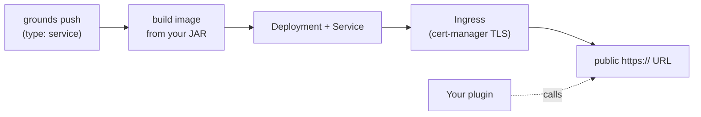

A **service** is a long-running backend app — no Minecraft world, no players, no Agones lifecycle. It's a plain JVM process that owns a domain (leaderboards, presence, shared config) and answers requests from the plugins running inside your game servers. You push it like any other app: `type: service` in your [`grounds.yaml`](/build/manifest), one JAR, `main` is the entrypoint.

This page covers the two things a `service` can be today — a self-contained HTTP backend you push and reach at its own URL, and the in-progress gRPC **domain-service** model where other apps call you through a typed contract — and is honest about which is which.

<Note>
A service is not the in-game minigame framework. The minigame API (`PaperMinigame`, teams, phases) is plugin-side code that runs *inside* a game server. A service is a separate workload that plugins call *out* to. If you're writing gameplay, you want a plugin; if you're holding shared state that outlives a single round, you want a service.
</Note>

## Service vs. plugin

The split is between **where game logic runs** and **where shared state lives**.

| | In-game plugin | Backend service |
|---|---|---|
| `type` | `plugin-paper`, `plugin-velocity`, `gamemode` | `service` |
| `baseImage` | `paper`, `velocity`, `paper-gamemode` | `service` |
| Runtime | Paper / Velocity server | Plain JVM (`main` is the entrypoint) |
| Lifecycle | Joins player sessions, ticks per game | Always-on request/response |
| Owns | Gameplay, player-facing UX | Domain data, shared logic |
| Role in a call | Client — it calls services | Server — it answers, today over HTTP |

A plugin holds the gameplay; a service holds the truth. A Mob Rush round decides *when* it ends and *what* the score is; a leaderboard service makes that score durable and rankable. The service never touches Minecraft.

## What you get when you push a service

Push a `type: service` app and forge gives you a plain Kubernetes `Deployment` plus a `Service` and a public HTTPS `Ingress` (cert-manager TLS). Your container listens on port `8080` and you get a public `https://` URL. From the platform's point of view it's the same push pipeline as a plugin — build the image from your JAR, deploy, tail logs — just without a Minecraft runtime wrapped around it.



What this is good for today: a self-contained HTTP backend — an API your plugins hit, a webhook receiver, a small admin endpoint. You own the framework and the routes inside the JAR; Grounds owns the build, the deploy, and the public URL.

<Warning>
A service-type app **does not get a managed database**. There is no per-app Postgres provisioning in the push path — your app gets a `Deployment`, not a database. Managed Postgres for pushed apps is roadmap, not a today capability; if you need durable shared state right now, point your service at storage you run yourself. See [Databases](/build/runtime/databases) for what does and doesn't persist.
</Warning>

## Pushing a service

A service uses the same flow as any other push — see [Pushes](/build/concepts/pushes) for the full lifecycle.

<Steps>
<Step title="Declare it in grounds.yaml">
Set `type: service` and `baseImage: service`. Your JAR's `main` becomes the container entrypoint — no Minecraft, no plugin loading.

```yaml grounds.yaml
name: my-backend
type: service
baseImage: service
```

`service` is single-JAR only: the [`plugins:`](/build/manifest#plugins-optional) multi-JAR block is rejected for this type.
</Step>

<Step title="Push it">
```bash
grounds push
```

Build, image, deploy — the same pipeline as a plugin. Tail the build with `grounds logs <pushId>`.
</Step>

<Step title="Reach it at its URL">
Once the push is `ready`, your service answers at its public HTTPS URL. Check **Deployments → your app** in the portal for the live URL and status, or tail runtime logs:

```bash
grounds logs deployment my-backend            # follow
grounds logs deployment my-backend --no-follow # snapshot
```
</Step>
</Steps>

## Configuring a service

A service is configured exactly like any other pushed app: per-deployment **environment variables** (shipped — use them today) and **encrypted secrets** (code is merged, but may not be switched on in your environment yet — secret writes return `503 secrets_unavailable` until the platform key is provisioned, while plain env vars keep working). Full detail, including the reserved `GROUNDS_` prefix and the once-only secret reveal, lives in [Environment variables and secrets](/build/runtime/environment-and-secrets).

## How a plugin calls a service

Today, with a self-pushed HTTP service, your plugin reaches it the ordinary way: you have a public HTTPS URL, so make an HTTP call to it. There's no automatic URL injection or auth wiring for arbitrary HTTP services — you hold the URL, you make the request.

The richer, typed story below (declare a dependency, get a URL and a token injected, call over gRPC) is the in-progress domain-service model — read the next section before you build against it.

## The domain-service model (early)

There's a more ambitious model in flight: first-class **domain services** that expose a typed gRPC API, that other apps *discover and call* through the manifest, with auth handled for you. `LeaderboardService` is the first vertical slice. Here's how it's meant to work, and exactly how far it actually reaches today.

The intended shape:

- Services publish a wire contract (`.proto`) so both sides generate matching stubs. Contracts compile to **JVM 21 bytecode** so they load cleanly into Java 21 Paper plugins.
- A consumer declares the service in a `services:` block; the platform injects a `<SERVICE>_SERVICE_URL` env var and a projected ServiceAccount token. Auth is k8s ServiceAccount tokens, not Keycloak — the consumer's SDK attaches the token, the service validates it.
- A plugin asks the SDK for a channel and calls a typed stub — no URL, JWT, or channel lifecycle in your code.

```kotlin
val channel = GroundsServices.channel("leaderboard")
val stub = LeaderboardServiceGrpc.newBlockingStub(channel)
val rank = stub.getPlayerRank(request)
```

<Warning>
**This is not a self-service capability yet.** The honest state today:

- The first domain service (`service-leaderboard`) has **no `grounds.yaml`** — it's deployed by platform engineers, not via `grounds push`. You cannot currently push a first-class registered gRPC domain-service through the supported flow.
- The consumer side (the `services:` declaration, the URL + token injection, a sample plugin) is wired, but `use:` is **documentation-only** — there's no registry or proto enforcement matching consumers to providers yet.
- The dedicated namespace and deployment module for these services are still pending.

So: you can push a self-contained HTTP service and reach it at its own URL today. You **cannot** yet push a registered gRPC domain service that other apps discover and call through the manifest. Treat the gRPC model as in-progress, not shipped.
</Warning>

## Talking to other apps over NATS (early)

Separately from gRPC, your pushed app can declare an `events:` block to publish to (and subscribe on) the Grounds message bus. The platform parses it, stamps the matching permissions onto your app's identity, and injects `NATS_URL` — the deny-by-default security layer around this is solid.

What's proven and what isn't:

- **Publishing from your own app** is infra-wired and works at that level — e.g. a gamemode push declaring `events: mobrush.results dir: pub` gets the wiring to publish.
- **Reliable cross-app pub/sub** — your app subscribing to and consuming *another independently-pushed app's* events end-to-end — has **not** been demonstrated through the supported flow. No app → NATS → app roundtrip between two separately pushed apps exists yet.

Declare-and-publish is early-but-real; cross-app messaging is roadmap. Don't design a feature around two of your apps talking over NATS until that path is proven.

## Where to look when it misbehaves

For a pushed service, your supported, project-scoped surfaces are the same as for any app:

- **Runtime logs** — **Deployments → your app → Logs** in the portal, or `grounds logs deployment <name>` (`--no-follow` to stop tailing). This tails your pod directly, scoped to your project.
- **Build logs** — `grounds logs <pushId>`.
- **Metrics** — the stat strip on the deployment detail page in the portal. If the metrics backend isn't configured you'll see a graceful `503`, not real numbers.

<Note>
Grafana at [grafana.platform.grnds.io](https://grafana.platform.grnds.io) is available for ad-hoc exploration if you have a `dev` or `admin` role on your Grounds Account (sign in with Keycloak). It is **not** project-isolated today — you may land as a global Viewer and see cluster-wide data — so treat it as an operator/internal tool, not your per-app log surface. For your own app's logs and metrics, use the portal and CLI above. See [Observability](/build/observability) for the full picture.
</Note>

## Related

<CardGroup cols={2}>
<Card title="Manifest reference" icon="file-lines" href="/build/manifest">
  The `type: service` workload shape, `baseImage` keys, and every other `grounds.yaml` field.
</Card>

<Card title="Pushes" icon="rocket" href="/build/concepts/pushes">
  The push lifecycle a service moves through — build, deploy, ready, retry, roll back.
</Card>

<Card title="Environment variables and secrets" icon="key" href="/build/runtime/environment-and-secrets">
  Per-deployment config for your service — plain env vars today, encrypted secrets once the platform key is live.
</Card>

<Card title="Config System" icon="sliders" href="/reference/plugins/config-system">
  A worked plugin-plus-service pair — the Config Plugin and Config API — showing the consumer side of the model.
</Card>
</CardGroup>
