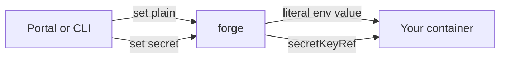

Your app needs configuration: a feature flag here, an upstream URL there, an API key it must not bake into the image. Grounds gives you two ways to set that, plus a set of built-in variables the platform injects for you.

- **Plain environment variables** — non-sensitive config. Stored as-is, rendered straight into your container's `env`. **Shipped — use these today.**
- **Encrypted secrets** — sensitive values (API keys, tokens). Encrypted at rest, shown once, injected via a Kubernetes Secret. **Rolling out — see [the secrets caveat](#secrets-are-rolling-out) before you rely on it.**

Both are set per deployment from the [portal](/build/portal) or the CLI — never edit Kubernetes objects directly. Forge owns that state and re-applies it on every push.

<Note>
Set values **per app**, not per project. Each deployment carries its own env and secrets; pushing a new build keeps them.
</Note>

## How values reach your process

You set values once. Forge merges them into your workload and injects them as standard environment variables — read them however your language reads env (`System.getenv("…")` on the JVM). Plain vars become literal `env` values; secrets become a `secretKeyRef` into a per-app Kubernetes Secret. Either way, your code just sees an environment variable.



Changes apply on your **next push**. Forge also tries to live-patch the running Deployment or Fleet as a best effort, but treat "takes effect on next push" as the reliable contract — paused and workspace-bundled workloads only pick changes up when you push again.

## The `GROUNDS_` prefix is reserved

The platform injects its own built-in variables, and they all start with `GROUNDS_`. To stop your config from shadowing them, **any variable name starting with `GROUNDS_` is rejected** when you set plain vars or secrets (case-sensitive, exact prefix). Pick any other name and you're fine.

The variables your app already receives without doing anything:

| Variable | What it is | Who gets it |
|---|---|---|
| `GROUNDS_TOKEN` | A fresh, project-scoped service-account token, rotated on every deploy, for calling back into the platform (e.g. a Paper plugin syncing the Minecraft whitelist). | Minecraft workloads and other app types |
| `NATS_URL` | Broker address for apps that declare an [`events`](/build/manifest) block. | Apps with declared events |

<Note>
`GROUNDS_TOKEN` here is **platform-issued and auto-rotated** — different from the `GROUNDS_TOKEN` *you* set in CI to authenticate `grounds push`. Same name, two contexts: in a running pod it's minted for you; in a pipeline you supply your own. See [CI tokens](/build/ci-tokens).
</Note>

## Naming and size rules

The same rules apply to plain vars and secrets:

| Rule | Detail |
|---|---|
| Name pattern | `^[A-Za-z_][A-Za-z0-9_]*$` (POSIX-style: letters, digits, underscores; no leading digit) |
| Reserved prefix | Names **cannot** start with `GROUNDS_` |
| Value size | Up to 8 KiB (UTF-8) per value |
| Uniqueness | No duplicate names in one request |

Setting plain vars is a **wholesale replace** — the list you send becomes the complete set, so include everything you want kept. You need `owner` or `editor` access on the project to change them.

## Set plain environment variables

<Steps>
<Step title="Open your app">
  In the [portal](/build/portal), go to **Deployments**, click your app, and open the **Env** tab.
</Step>
<Step title="Add or edit variables">
  Add `KEY=value` rows for your non-sensitive config — log levels, feature flags, upstream hostnames. Names can't start with `GROUNDS_`.
</Step>
<Step title="Save">
  Saving replaces the full plain-var set. Forge persists it and re-renders it into your workload.
</Step>
<Step title="Apply with a push">
  Push your app to make the change take effect. Read the value at runtime as a normal environment variable.

  ```java
  String logLevel = System.getenv("LOG_LEVEL"); // -> "debug"
  ```
</Step>
</Steps>

<Tip>
Plain env vars require no key, no special configuration, and nothing provisioned ahead of time. This is the reliable path — keep anything non-sensitive here.
</Tip>

## Set encrypted secrets

<Warning id="secrets-are-rolling-out">
**Secrets are rolling out and may not be enabled on every instance yet.** The code is complete — values are AES-256-GCM encrypted at rest and injected through a Kubernetes Secret — but a secret write needs the platform's encryption key provisioned on the forge instance you're talking to. Until that's in place, **writing a secret returns a clear `503 secrets_unavailable` error** telling you the key isn't provisioned. **Plain env vars are unaffected** and keep working. If you hit that error, fall back to a plain var for now or ask in `#grounds-platform` whether secrets are live on your environment.
</Warning>

When secrets are enabled on your instance, they behave like this:

- You set a secret from the **Env** tab (or CLI), marking the value as secret.
- Forge encrypts it with **AES-256-GCM** before storing it — the plaintext is never persisted in the clear.
- The plaintext is echoed back to you **exactly once**, in the response that sets it. After that, listing shows only the name and when it changed — never the value. **Copy it then; you can't read it back.**
- On deploy, forge decrypts it into a per-app Kubernetes Secret and injects it into your container via `secretKeyRef`, so your code reads it as a normal environment variable.

<Steps>
<Step title="Open the Env tab">
  Same place as plain vars: **Deployments → your app → Env**.
</Step>
<Step title="Add a secret">
  Add the variable, mark it as a **secret**, and paste the value. Same naming rules — no `GROUNDS_` prefix, up to 8 KiB.
</Step>
<Step title="Copy the revealed value">
  The value is shown back to you **once**. Copy it now if you need a record — it won't be displayed again.
</Step>
<Step title="Apply with a push">
  Push to inject the secret. Read it at runtime exactly like any other env var.
</Step>
</Steps>

<Info>
Encryption protects the secret **at rest** in the platform database. At deploy time the value lands in a Kubernetes Secret in your namespace, decrypted, so the in-cluster trust boundary is the same one that holds `GROUNDS_TOKEN`. This is config-grade secret handling, not an HSM.
</Info>

## Limits and what's not here yet

<AccordionGroup>
<Accordion title="No managed database for your app (yet)">
  A pushed app does **not** get a Postgres database provisioned for it. There's no per-app managed database today — persistence is whatever volume your pod declares in its own namespace. Managed Postgres for developer apps is on the roadmap, not a current capability. If you need state now, point a secret at your own external database. See [Databases](/build/runtime/databases) for what persists across pushes and how to ask for managed Postgres.
</Accordion>
<Accordion title="Declaring + publishing NATS events is early">
  Your `grounds.yaml` can declare an [`events`](/build/manifest) block, and forge wires the infrastructure: it stamps your app's service account, projects a token, and injects `NATS_URL`. A publish-only app (for example a gamemode emitting result events) is wired to publish, and the security layer (deny-by-default auth) is sound.

  What is **not** proven: one pushed app reliably **subscribing to and consuming another pushed app's** events end to end. No app-to-app round trip through the supported push flow has been demonstrated. Declare-and-publish from your own app: early, works at the infrastructure level. Reliable cross-app messaging: treat as roadmap.
</Accordion>
<Accordion title="HTTP services work; registered gRPC domain-services don't (yet)">
  You can push a `type: service` app today and get a Deployment, a Service, and a public `https://` URL with TLS — a self-contained HTTP service you reach at its own address works.

  What's **not** here yet: a first-class **registered gRPC domain-service** that other apps discover and call through the supported flow (the in-progress Service Architecture work). The `services:` / `provides:` manifest fields are documentation today; there's no registry or proto enforcement on the push path. Build self-contained HTTP services now; cross-service gRPC discovery is in progress.
</Accordion>
</AccordionGroup>

## Where to see your config in action

To confirm your variables landed and your app is reading them, check its **runtime logs** — the supported, project-scoped surface:

- Portal: **Deployments → your app → Logs**, or
- CLI: `grounds logs deployment <name>` (it tails by default; pass `--follow=false` to read the current logs and exit).

Both stream your pod's logs directly, scoped to your project. App metrics show on the deployment detail page. For the full picture, see [Observability](/build/observability).

## Related

<CardGroup cols={2}>
<Card title="Portal" icon="browser" href="/build/portal">
  Where the Env tab lives — set plain vars and secrets, see logs and metrics.
</Card>
<Card title="Manifest reference" icon="file-code" href="/build/manifest">
  `grounds.yaml` fields, including the `events` block your app declares.
</Card>
<Card title="CI tokens" icon="robot" href="/build/ci-tokens">
  The other `GROUNDS_TOKEN` — project-scoped tokens for non-interactive `grounds push`.
</Card>
<Card title="Observability" icon="chart-line" href="/build/observability">
  Logs, metrics, and traces for a running app.
</Card>
</CardGroup>
