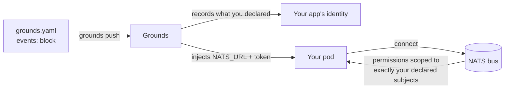

Grounds gives your plugins, gamemodes, and services a shared [NATS](https://nats.io) message bus so they can publish and subscribe to events instead of polling or wiring up point-to-point HTTP. You declare which subjects your app touches in your [manifest](/build/manifest); at runtime your pod gets a connection that's already scoped to exactly those subjects — nothing to provision, no credentials to manage, and no way to read another tenant's traffic.

You never mint a token, write a broker config, or manage NATS accounts — that's all platform machinery. From your side, messaging is two things: a small block in `grounds.yaml`, and a connection your code reads from the environment.

<Warning>
**Read the [maturity section](#what-works-today) before you build on this.** Declaring events and **publishing** from your own pushed app is wired at the infrastructure level and works for the publish direction. A full **cross-app roundtrip** — your app subscribing to and consuming another independently-pushed app's events through the supported push flow — has **not** been proven end to end yet. Treat reliable cross-app pub/sub as roadmap, not a shipped capability. This page describes the model and the honest current status, not a how-to for something that isn't there yet.
</Warning>

## The model for you

Messaging on Grounds follows one rule: **you only get what you declare.**

1. You add an `events:` block to `grounds.yaml` listing each subject and whether you publish to it, subscribe to it, or both.
2. When you push, the platform records that declaration against your app and injects a connection — a `NATS_URL` and a short-lived identity token — into your pod.
3. When your app connects, the broker grants it permissions derived from your declaration. If you declared `dir: pub` on `match.ended`, you can publish that subject and nothing else; you can't subscribe to it, and you can't touch subjects you never asked for.



The important consequence: **subjects are isolated per tenant.** Your app connects with its own identity, and the permissions it gets are computed from your declaration alone. Another developer's app on the same bus can't grant itself access to your subjects, and a denied-by-default policy means anything you didn't declare is off-limits. You don't configure any of this — it's the default you get.

<Note>
If your app has no `events:` block, it's simply not a bus participant — no `NATS_URL`, no token, no connection. Messaging is opt-in per app.
</Note>

## Declaring events

Add an `events:` block to your `grounds.yaml`. Each entry is a subject plus a direction:

```yaml grounds.yaml
name: mobrush
type: gamemode
baseImage: paper-gamemode
events:
  - subject: mobrush.results
    dir: pub          # this app publishes match results
  - subject: config.updated
    dir: sub          # this app reacts to config changes
  - subject: lobby.chat
    dir: both         # dir defaults to "both" if omitted
```

| Field | What it means |
|---|---|
| `subject` | The NATS subject. Must be **lowercase**, start with a letter, and contain only letters, digits, dots, and the NATS wildcards `*` (one token) and `>` (everything below). |
| `dir` | `pub`, `sub`, or `both`. Defaults to `both`. Controls which permissions you're granted for that subject. |

You can declare up to **50** entries. Subjects are validated at push time — a subject that breaks the rules above fails the push.

<Tip>
Declare the **narrowest** direction you actually need. `dir: pub` for a publisher and `dir: sub` for a consumer keeps your blast radius small and makes the intent of your app obvious to teammates reviewing the manifest.
</Tip>

## The connection you get

After a push with an `events:` block, your pod has two values injected into its environment:

| Variable | What it is |
|---|---|
| `NATS_URL` | The broker your app should connect to. The platform sets the right value for where your app landed — you don't choose it. |
| `GROUNDS_TOKEN_FILE` | Path to a short-lived identity token file your client presents when connecting. The platform rotates it for you (~1h, picked up live — no pod restart). |

You don't construct the URL or build credentials by hand. Read these from the environment and connect.

<Tabs>
<Tab title="Grounds SDK (recommended)">

The SDK reads the injected environment and presents the token for you:

```kotlin
val events = GroundsEvents.connect()          // reads NATS_URL + GROUNDS_TOKEN_FILE
events.on("config.updated") { msg -> /* react */ }
events.publish("mobrush.results", payload)
```

You never touch the URL or the token. Connect, subscribe to subjects you declared `sub`/`both` on, publish to subjects you declared `pub`/`both` on.

</Tab>
<Tab title="Raw jnats">

If you're not using the SDK, read the token from `GROUNDS_TOKEN_FILE` and present it as the connection bearer:

```kotlin
val token = File(System.getenv("GROUNDS_TOKEN_FILE")).readText().trim()
val options = Options.Builder()
    .server(System.getenv("NATS_URL"))
    .authHandler(/* present token as bearer */)
    .build()
val nc = Nats.connect(options)
```

The token rotates roughly hourly. Re-read `GROUNDS_TOKEN_FILE` before each connect so a reconnect always presents the current token — or just use the SDK, which does this for you.

</Tab>
</Tabs>

<Note>
A freshly-changed `events:` block can take up to about a minute to take effect after a push, because the permission lookup is briefly cached. If a new subscription doesn't work immediately, give it a moment and reconnect.
</Note>

## Subject isolation

Subjects are plain, lowercase strings on a shared bus. Two apps that both publish a bare `config.updated` are publishing the *same* subject — so today, **pick subject names that are unlikely to collide** (prefix them with your app or domain, e.g. `mobrush.results` rather than `results`).

The permission layer keeps you from *reading or writing* subjects you didn't declare — that's enforced and is the real security boundary. What isn't automatic yet is **namespacing**: a richer per-project / per-target subject prefix that would make collisions structurally impossible is designed but not wired into the bus you connect to. Until it ships, naming discipline is your isolation against name clashes within the shared bus.

<Info>
The deny-by-default permission model — you can only touch subjects you declared — **is** the shipped behavior of the security layer. Automatic per-tenant subject *prefixing* is the part that's still on the roadmap. Don't rely on prefix-based isolation existing yet; rely on declaring narrowly and naming your subjects distinctly.
</Info>

## What works today

Be realistic about maturity before you design around this.

<CardGroup cols={2}>
<Card title="Cross-server within one server set — proven" icon="circle-check">
Two Minecraft servers behind the same bus relay messages by both declaring compatible subjects. This is verified end to end (a chat / direct-message relay between two Paper servers over one NATS), and it's the working reference for cross-server coordination.
</Card>
<Card title="Cross-app between separate pushes — early" icon="triangle-exclamation">
Two **independently pushed** apps doing a full publish-then-consume roundtrip through the supported push flow has **not** been demonstrated. The permission scoping is wired and the security model is sound, but no app to bus to app message has been confirmed flowing the whole way. Treat it as roadmap.
</Card>
</CardGroup>

Where the line is, concretely:

<AccordionGroup>
<Accordion title="Declaring events on your pushed app — works">
Your `grounds.yaml` `events:` block is parsed, carried through the push, and recorded against your app's identity. Your pod gets `NATS_URL` and the token. This is real today for any pushed app that declares events.
</Accordion>

<Accordion title="Publishing from your own app — works at the infra level">
A pushed app declaring `dir: pub` (for example a gamemode publishing `mobrush.results`) is wired to publish. The permission set grants exactly that, and the connection is scoped correctly. The publish path is the more mature direction.
</Accordion>

<Accordion title="Subscribing to and consuming another app's events — not yet proven e2e">
No two independently-pushed apps have been shown to complete a publish-then-consume roundtrip through the supported flow. The internal debug tooling that reads the bus is **not** a pushed app and doesn't count as proof of the developer path. If your design depends on app B reliably consuming app A's events, that's unproven today — build a fallback or check in with the platform team before committing to it.
</Accordion>

<Accordion title="Persistence / replay of past events — not available">
The bus delivers live messages to connected subscribers. There is no retained-history or replay stream you can rely on yet — an app that wasn't connected when a message was published won't see it later.
</Accordion>
</AccordionGroup>

The security layer itself — declare, get a scoped connection, deny everything you didn't ask for — is sound and is the part you can trust. The gap is purely in the *cross-app delivery* path being unproven end to end, not in the isolation model.

## Limits and caveats

- **Subjects are flat strings.** Names are your only collision protection today; prefix them. Automatic per-tenant prefixing is roadmap.
- **Opt-in only.** No `events:` block means no bus access — there's no implicit connection.
- **Token rotates.** Re-read `GROUNDS_TOKEN_FILE` on each connect (or use the SDK) so rotation stays transparent; a connect-once raw client holds its original scope until it reconnects.
- **Declaration changes lag briefly.** Allow up to ~a minute after a push for a changed `events:` block to take effect.
- **No replay.** Only live messages reach connected subscribers; there's no history fetch you can depend on.
- **Cross-app delivery is unproven.** Publishing works; another pushed app reliably consuming it does not, yet.

## Related

<CardGroup cols={2}>
<Card title="Manifest reference" icon="file-code" href="/build/manifest">
  Every field of `grounds.yaml`, including where the `events:` block sits in your app definition.
</Card>

<Card title="Pushes" icon="rocket" href="/build/concepts/pushes">
  How a push goes from upload to a running pod — the step that injects your connection.
</Card>

<Card title="Observability" icon="chart-line" href="/build/observability">
  Where to find your deployment logs and metrics when you're debugging what your app sent or received.
</Card>

<Card title="Platform test environment" icon="flask" href="/build/test-environment">
  Spin up an isolated environment to iterate on a component that uses the bus.
</Card>
</CardGroup>
