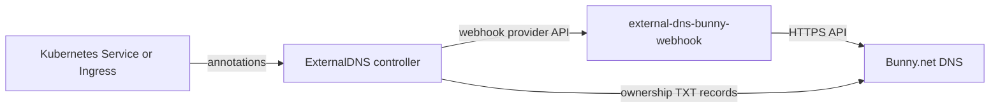

Use `external-dns-bunny-webhook` when you want Kubernetes services, ingresses, or gateway routes
to publish their DNS records directly into <Tooltip tip="DNS authoritative service provided by Bunny.net — the same vendor that runs Bunny CDN.">Bunny.net</Tooltip>
through <Tooltip tip="Kubernetes addon that turns Service and Ingress hostnames into DNS records on external providers." cta="Read external-dns docs" href="https://kubernetes-sigs.github.io/external-dns/">ExternalDNS</Tooltip>.

The webhook runs as a sidecar next to the official ExternalDNS controller and speaks the
ExternalDNS webhook provider contract. ExternalDNS reconciles desired records against your cluster
state, the webhook translates those records into Bunny.net API calls.

## Features

- Manages A, AAAA, CNAME, TXT, and related records through the Bunny.net API
- Supports the standard ExternalDNS ownership <Tooltip tip="A DNS TXT record that external-dns writes to mark the records it owns. Prevents external-dns from touching records created manually or by another tool.">TXT registry</Tooltip>
- Exposes health and metrics endpoints on a separate port for Kubernetes probes
- Adds Bunny-specific record controls through annotations: disabled records, monitoring, weight,
  and smart DNS routing by latency or geography

## When to Use It

Use this provider when your DNS lives in Bunny.net and you want Kubernetes to own the record
lifecycle. If you mix manual dashboard records with ExternalDNS-managed records, use the
ownership TXT registry to keep the two sets separate.

<Note>
The provider is a standalone ExternalDNS extension. It does not require any other Grounds service
and can be deployed into any Kubernetes cluster that runs ExternalDNS.
</Note>

## How It Fits Together

ExternalDNS and the webhook run in the same pod. The controller calls the webhook on
`http://localhost:8888`, and the webhook exposes a separate health endpoint on
`http://0.0.0.0:8080` for Kubernetes probes.

## Maintainership

The provider is forked and maintained under the `groundsgg` organization but it is not an
officially Bunny.net-supported product. Bugs and feature requests should go to the
[GitHub repository](https://github.com/groundsgg/external-dns-bunny-webhook). Questions about the
Bunny.net DNS product itself should go to Bunny.net support.

## Quick Links

<CardGroup cols={2}>
<Card title="Installation" icon="download" href="/platform/external-dns-bunny-webhook/installation">
  Deploy the webhook alongside ExternalDNS using the official Helm chart.
</Card>

<Card title="Configuration" icon="sliders" href="/platform/external-dns-bunny-webhook/configuration">
  Tune runtime environment variables and control records through Bunny-specific annotations.
</Card>

<Card title="GitHub Repository" icon="github" href="https://github.com/groundsgg/external-dns-bunny-webhook">
  Browse the source, releases, and issue tracker.
</Card>

<Card title="ExternalDNS Docs" icon="book" href="https://kubernetes-sigs.github.io/external-dns/">
  Reference documentation for the ExternalDNS controller that drives this provider.
</Card>
</CardGroup>
