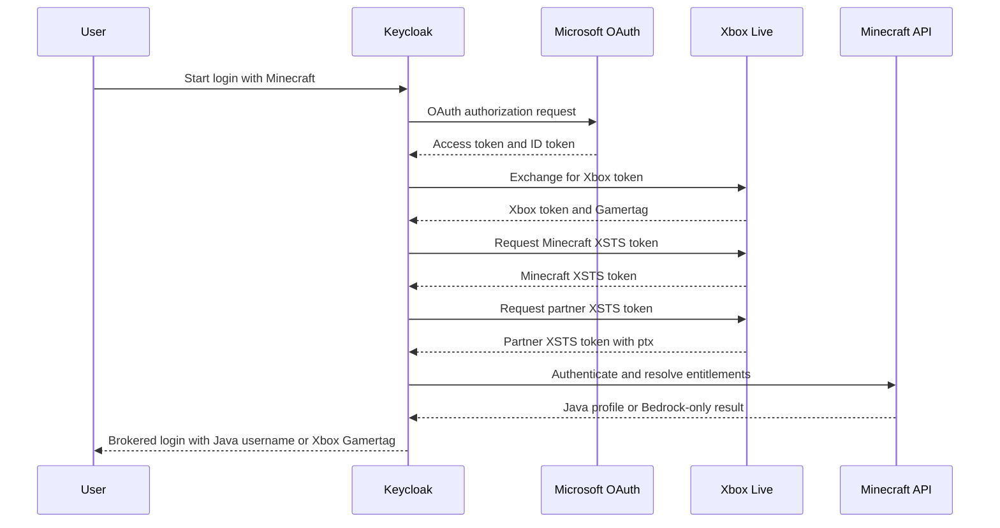

The `keycloak-minecraft-idp` plugin adds a `Minecraft` identity provider to Keycloak. It uses Microsoft OAuth, exchanges tokens with Xbox Live and Minecraft services, and resolves the brokered login to the Minecraft Java username when available or to the Xbox Gamertag for supported Bedrock logins.

It is a general-purpose Keycloak extension and is not tied to Grounds. You can use it in any Keycloak deployment that needs Minecraft-backed sign-in.

## Quick Links

<CardGroup cols={2}>
<Card title="GitHub Repository" icon="github" href="https://github.com/groundsgg/keycloak-minecraft">
  View the source code, releases, and implementation details.
</Card>

<Card title="Installation" icon="download" href="/platform/keycloak-minecraft-idp/installation">
  Install the provider JAR into Keycloak and configure the required Microsoft app registration.
</Card>

<Card title="Configuration" icon="sliders" href="/platform/keycloak-minecraft-idp/configuration">
  Set up partner XSTS, optional vault-backed secrets, and managed user attributes.
</Card>
</CardGroup>

## Features

- Supports Minecraft Java Edition sign-in through Keycloak
- Supports Bedrock logins by falling back to the Xbox Gamertag when applicable
- Uses the Xbox partner `ptx` claim for stable brokered account linking
- Stores managed Minecraft and Xbox attributes on the Keycloak user
- Optionally synchronizes Microsoft real-name claims into Keycloak profile fields

## Login Resolution

The provider resolves the final Keycloak login identity with these rules:

| Account state | Login identity |
| --- | --- |
| Java entitlement and Java profile exist | Minecraft Java username and UUID |
| Bedrock entitlement only | Xbox Gamertag |
| Java entitlement exists, no Java profile yet, Bedrock entitlement exists | Xbox Gamertag |
| Java entitlement exists, no Java profile yet, no Bedrock entitlement | Login fails until the Java profile is created in the Minecraft Launcher |
| No Java or Bedrock entitlement | Login fails |

## Authentication Flow

<Note>
The provider is implemented as a regular Keycloak identity provider. After installation it appears in the Keycloak admin UI as `Minecraft`.
</Note>
