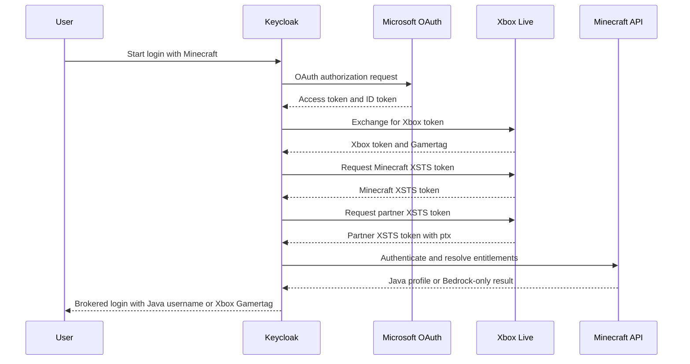

Use `keycloak-minecraft-idp` when you want players to sign in to Keycloak with Minecraft-backed Microsoft accounts.

The plugin adds a `Minecraft` <Tooltip tip="A Keycloak login source that delegates authentication to another system.">identity provider</Tooltip> to Keycloak. It uses Microsoft OAuth, exchanges tokens with Xbox Live and Minecraft services, and resolves the <Tooltip tip="A sign-in handled by an external identity provider and then mapped back to a Keycloak user.">brokered login</Tooltip> to the Minecraft Java username when available or to the Xbox Gamertag for supported Bedrock logins.

It is a general-purpose Keycloak extension and is not tied to Grounds. You can use it in any Keycloak deployment that needs Minecraft-backed sign-in.

If you are setting up the provider, start with the [installation guide](/platform/keycloak-minecraft-idp/installation) and then continue with the [configuration guide](/platform/keycloak-minecraft-idp/configuration).

## Quick Links

<CardGroup cols={2}>
<Card title="GitHub Repository" icon="github" href="https://github.com/groundsgg/keycloak-minecraft">
  View the source code, releases, and implementation details.
</Card>

<Card title="Installation" icon="download" href="/platform/keycloak-minecraft-idp/installation">
  Install the provider JAR into Keycloak and configure the required Microsoft app registration.
</Card>

<Card title="Configuration" icon="sliders" href="/platform/keycloak-minecraft-idp/configuration">
  Set up partner token handling, optional vault-backed secrets, and user attribute updates.
</Card>
</CardGroup>

## Features

- Supports Minecraft Java Edition sign-in through Keycloak
- Supports Bedrock logins by falling back to the Xbox Gamertag when applicable
- Uses the Xbox partner <Tooltip headline="ptx claim" tip="A stable partner-scoped Xbox identifier used to link the same external account across logins." cta="Read Microsoft docs" href="https://learn.microsoft.com/en-us/gaming/gdk/docs/services/fundamentals/s2s-auth-calls/service-authentication/security-tokens/live-token-claims?view=gdk-2510"><code>ptx</code> claim</Tooltip> for stable brokered account linking
- Stores <Tooltip tip="Provider-owned user attributes that are updated on each successful login.">managed attributes</Tooltip> on the Keycloak user
- Optionally synchronizes Microsoft real-name claims into Keycloak profile fields

## Login Resolution

Use these rules to understand which login identity Keycloak will store for the user.

An <Tooltip tip="Ownership of a game edition as confirmed by Minecraft services.">entitlement</Tooltip> determines whether the account can continue through Java or Bedrock login resolution.

| Account state                                                            | Login identity                                                          |
|--------------------------------------------------------------------------|-------------------------------------------------------------------------|
| Java entitlement and Java profile exist                                  | Minecraft Java username and UUID                                        |
| Bedrock entitlement only                                                 | Xbox Gamertag                                                           |
| Java entitlement exists, no Java profile yet, Bedrock entitlement exists | Xbox Gamertag                                                           |
| Java entitlement exists, no Java profile yet, no Bedrock entitlement     | Login fails until the Java profile is created in the Minecraft Launcher |
| No Java or Bedrock entitlement                                           | Login fails                                                             |

## Authentication Flow

The sign-in flow uses Xbox <Tooltip headline="XSTS" tip="Xbox Secure Token Service tokens used to authorize calls to Xbox and Minecraft services." cta="Read Microsoft docs" href="https://learn.microsoft.com/en-us/gaming/gdk/docs/services/fundamentals/s2s-auth-calls/service-authentication/security-tokens/live-security-tokens?view=gdk-2510">XSTS</Tooltip> tokens to resolve Minecraft access and partner-scoped account identity.

<Note>
After installation, the provider appears in the Keycloak admin UI as `Minecraft`.
</Note>
