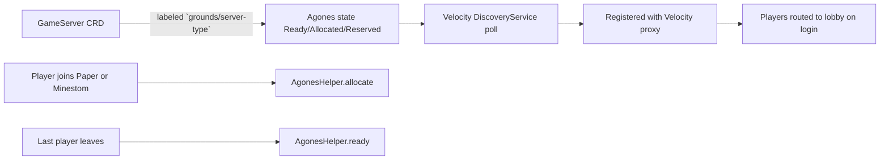

Use plugin-agones when your gameserver runs inside the Grounds Kubernetes cluster and you need
Agones lifecycle state to track your actual player activity without writing custom SDK code.

The plugin translates player events into Agones `Ready` and `Allocated` transitions, and lets the
Velocity proxy discover running gameservers through the Kubernetes API so players are routed to a
lobby automatically.

## What the Plugin Does

On Paper and Minestom, the plugin reports your gameserver's Agones state from the current player
count:

- the first player joins → the runtime calls `Allocate`
- the last player leaves → the runtime calls `Ready`
- a 10 second fallback loop reconciles the state if an event is missed

On Velocity, the plugin adds two responsibilities on top of proxy-side state sync:

- it polls the Kubernetes API for running gameservers and registers them with the proxy
- it routes newly joining players to a lobby server and rejects logins when no lobby is available

<Info>
`plugin-agones` assumes your gameserver pod runs with an Agones sidecar exposing the SDK on
`http://localhost:9358`. The Grounds container images ship this configuration by default.
</Info>

## Module Layout

The repository ships four modules. Gamemode developers consume the platform module matching their
runtime.

| Module     | Target             | Delivery                               |
|------------|--------------------|----------------------------------------|
| `common`   | shared runtime     | used transitively by the three others  |
| `velocity` | Velocity proxy     | Velocity plugin JAR                    |
| `paper`    | Paper gameservers  | Paper plugin JAR                       |
| `minestom` | Minestom servers   | Kotlin library you embed into your app |

## Gameserver Discovery Contract

The Velocity discovery path depends on three conventions that your gameserver deployment must
follow:

- the pod runs in the `games` Kubernetes namespace
- the Agones `GameServer` carries the label `grounds/server-type` with one of `lobby`, `game`, or
  `match`
- the pod exposes Minecraft on port `25565` and reports its `PodIP` under `status.addresses`

When these conditions are met, the Velocity proxy picks up the gameserver automatically as soon as
Agones transitions it into `Ready`, `Allocated`, or `Reserved`.

<Note>
`lobby` is treated specially: at least one `Ready`/`Allocated`/`Reserved` gameserver with
`grounds/server-type=lobby` must exist for new proxy logins to succeed.
</Note>

## Choose Your Platform

<CardGroup cols={3}>
<Card title="Velocity" icon="network-wired" href="/plugins/agones/velocity">
  Learn how the Velocity proxy discovers gameservers, routes players to lobbies, and exposes the
  `/agones` operator command.
</Card>

<Card title="Paper" icon="server" href="/plugins/agones/paper">
  Install the Paper plugin and let the runtime manage your Agones state from player join and quit
  events.
</Card>

<Card title="Minestom" icon="cubes" href="/plugins/agones/minestom">
  Embed the Minestom library in your gamemode server to sync Agones state without touching the SDK
  directly.
</Card>
</CardGroup>

## Typical Use

Use this plugin when:

- your gameserver deploys into the Grounds Agones-managed cluster
- you want Agones state to reflect real player activity instead of a static allocation call
- your gamemode publishes its role through `grounds/server-type` so the Velocity proxy can route to
  it

If you are integrating a new gamemode server now, continue with the platform page that matches your
runtime.
