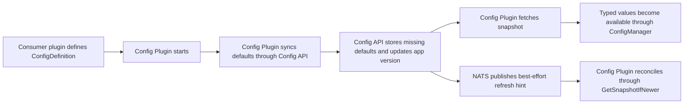

Use the Config System when you want plugins to consume typed runtime configuration from a shared
backend service.

The system is split into two parts:

- `Config Plugin (Paper/Velocity)` runs inside your Minecraft server or proxy and exposes
  `ConfigManager` to other plugins
- `Config API` stores the authoritative config documents, versions them per `app` and `env`, and
  serves snapshots over gRPC

## How It Fits Together

Each config document is identified by these fields:

- `app`: the application or service namespace your plugin registers against
- `env`: the environment inside that application, such as `prod` or `staging`
- `namespace`: the logical config namespace inside the app
- `key`: the document key inside the namespace
- typed payload: the JSON body mapped into your Kotlin type

At runtime, a plugin defines typed defaults locally, registers those definitions for an
`(app, env)` scope, and then reads typed values through `ConfigManager`.

<Info>
The authoritative state is the snapshot served by `Config API`. NATS exists to reduce reload
latency, not to define correctness.
</Info>

## Core Contract

The Config System is snapshot-based.

- `Config API` stores the authoritative config state in Postgres
- `Config Plugin` syncs defaults, loads snapshots, and applies them to local typed bindings
- NATS change events may be delayed, duplicated, or missed
- Consumers must reconcile through `GetSnapshotIfNewer` instead of deriving state from NATS payloads

That contract matters when you choose startup behavior, react to change events, or diagnose stale
config in production.

## Start Here

<CardGroup cols={2}>
<Card title="Config Plugin (Paper/Velocity)" icon="plug" href="/plugins/config-system/config-plugin">
  Integrate typed config into Paper and Velocity plugins, define defaults, register documents, and
  react to updates.
</Card>

<Card title="Config API" icon="server" href="/plugins/config-system/config-api">
  Understand the backend service, consumer and admin gRPC surfaces, and the current operational
  caveats.
</Card>

<Card title="Runtime Behavior" icon="arrows-rotate" href="/plugins/config-system/runtime-behavior">
  Read the bootstrap, reconciliation, degraded startup, and best-effort NATS delivery contract.
</Card>
</CardGroup>

## Typical Use

Use this model when:

- multiple plugins need consistent config delivery from a shared service
- you want typed config access instead of reading raw JSON at every call site
- you need default documents to be created automatically when a plugin starts
- you want live config refresh without coupling correctness to event delivery

If you are integrating a plugin now, continue with
[Config Plugin (Paper/Velocity)](/plugins/config-system/config-plugin).
