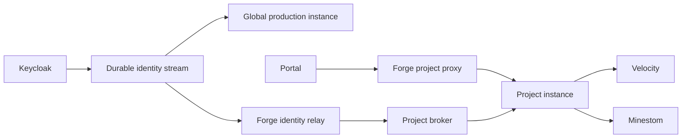

Grounds separates global identity coordination from project-local runtime
authorization. That keeps player checks local to a project while allowing
identity changes to propagate safely across the platform.

## Global production instance

The global production `service-permissions` instance runs in the management
cluster. It owns durable permission and identity data for its scope, reads the
central Keycloak realm with minimum read-only access, consumes identity-change
events, and exposes the authenticated control-plane API.

<Info>
The global production instance is a control-plane component. Minecraft plugins
do not use it as their runtime endpoint.
</Info>

## Project instances

Each project receives a `service-permissions` instance from the platform
bundle inside that project's vCluster. The project instance keeps its own
project-local permission data and exposes the local gRPC endpoint that the
project's Velocity and Minestom workloads use.

Portal calls Forge's authorized project proxy. Forge forwards the request to
the selected project instance, so Portal does not need direct network access to
a project vCluster.

## Identity propagation and recovery

<Steps>
<Step title="Publish an identity change">
Keycloak publishes a minimal identity invalidation to a durable central stream.
</Step>

<Step title="Relay it to the project">
Forge relays the invalidation to the appropriate project broker. Forge does not
calculate runtime policy.
</Step>

<Step title="Refresh project state">
The project service refreshes its identity projection and makes newer snapshots
available to its local runtimes.
</Step>

<Step title="Reconcile after delays">
Scheduled identity reconciliation and runtime snapshot refresh recover when an
event is delayed or unavailable.
</Step>
</Steps>

## Runtime boundary

Velocity and Minestom connect only to the local `service-permissions` endpoint
inside their own project vCluster. They fetch complete snapshots at login and
evaluate later permission checks locally. A plugin must not call a central
service or another project's service directly.

## Security behavior

- The Keycloak reader receives only the identity read permissions it needs.
- Forge relays authorized requests and invalidations but is not a runtime
  policy authority.
- Missing or expired runtime snapshots fail closed.
- Identity state that is too stale can prevent a permission service from being
  ready until it synchronizes again.

## Next steps

- [Manage project policy in Portal](/reference/in-game-permissions/administration)
- [Configure local runtime clients](/reference/in-game-permissions/runtime-integration)
- [Configure Minecraft identities in Keycloak](/deploy/keycloak-minecraft-idp)
