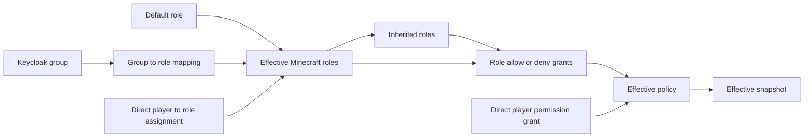

Use Minecraft permissions to control what players can do across a Grounds
network. Administrators create policy in Portal; Velocity and Minestom
workloads receive complete permission snapshots and check them locally.

<Info>
In-game permissions are separate from [Portal access](/build/portal/control-center-access).
Portal access decides who can administer the platform. Minecraft permissions
decide what a player may do inside the Minecraft network.
</Info>

## Choose your task

<CardGroup cols={2}>
<Card title="Manage permissions" icon="user-shield" href="/reference/plugins/in-game-permissions/administration">
  Create roles, map Keycloak groups, grant player exceptions, and inspect effective access.
</Card>
<Card title="Integrate a runtime" icon="plug" href="/reference/plugins/in-game-permissions/runtime-integration">
  Configure the Velocity plugin or Minestom module and make local permission checks.
</Card>
<Card title="Register permission nodes" icon="list-check" href="/reference/plugins/in-game-permissions/permission-catalog">
  Publish your workload's permission catalog and manage custom entries.
</Card>
<Card title="Understand the infrastructure" icon="diagram-project" href="/reference/plugins/in-game-permissions/infrastructure">
  Learn why Grounds has global and project-local permission service instances.
</Card>
</CardGroup>

## Authorization model

| Term                             | Meaning                                                                        |
|----------------------------------|--------------------------------------------------------------------------------|
| Keycloak group                   | Read-only identity input that can map to a Minecraft role.                     |
| Minecraft role                   | Reusable grants; it can inherit another role or be a default role.             |
| Grant                            | Allow or deny rule at global, server-type, or server scope.                    |
| Group-to-role mapping            | Assigns a Minecraft role to every player in one Keycloak group; it can expire. |
| Direct player-to-role assignment | Assigns a reusable role to one player; it can expire.                          |
| Direct player grant              | Time-limited or permanent exception for one player.                            |
| Effective snapshot               | Complete, versioned result evaluated locally by a runtime.                     |

### Assignment sources

| Source                 | Assignment                | Result                                                         |
|------------------------|---------------------------|----------------------------------------------------------------|
| Default role           | Role -> every player      | The role's grants apply to every player.                       |
| Keycloak group mapping | Keycloak group -> role    | Members receive the mapped role and its inherited roles.       |
| Direct role assignment | Player -> role            | One player receives the selected role and its inherited roles. |
| Direct player grant    | Player -> permission node | One player receives an allow or deny exception without a role. |

Keycloak groups never map directly to permission nodes: they provide group-to-role
assignments. A role can then carry allow or deny grants, including inherited
role grants. Exact patterns such as `network.chat.moderate` and wildcards such
as `network.chat.*` can match a check. Server scope wins over server-type
scope, which wins over global scope; a deny wins between equally specific
candidates.

Once a snapshot expires, a check returns `false` until a valid replacement is
available. Changing a permission does not disconnect a player automatically.

## Next steps

- [Manage in-game permissions in Portal](/reference/plugins/in-game-permissions/administration)
- [Configure Velocity or Minestom](/reference/plugins/in-game-permissions/runtime-integration)
- [Set up the Minecraft Keycloak identity provider](/deploy/keycloak-minecraft-idp)
