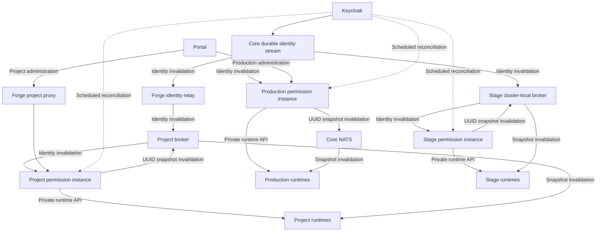

Grounds separates permission policy between production, stage, and individual
projects. Each environment owns its policy and identity projection, and each
runtime connects only to the permission instance assigned to that environment.



## Production

The production permission instance owns the platform's live Minecraft policy
and its identity projection. Portal uses its authenticated administration API,
while production runtimes use a separate private runtime API to fetch player
snapshots and register authorized catalog sources. After persisting a relevant
identity change, the instance publishes a snapshot invalidation to its assigned
runtimes through Core NATS.

<Info>
Administration and runtime traffic use separate API surfaces. Browser-facing
routes do not expose the private runtime API.
</Info>

## Stage

The stage permission instance provides isolated pre-production policy and a
private runtime API for stage workloads. This allows service and policy changes
to be exercised without making a stage runtime depend on production runtime
availability.

<Info>
Stage consumes real-time identity changes and publishes snapshot invalidations
through its private cluster-local NATS broker. Scheduled reconciliation and the
runtime snapshot sweep remain fallback paths for missed or delayed events.
</Info>

## Projects

Each project receives a `service-permissions` instance from the platform
bundle. The instance keeps project-local policy and identity data. Workloads in
that project fetch snapshots and register authorized catalog sources through
its private REST API. The bundle declares the instance's publish subject and
each runtime's subscribe subject, and it supplies each runtime's `NATS_URL`
from the shared project broker explicitly.

Portal calls Forge's authorized project proxy. Forge forwards the request to
the selected project instance after checking project access, so Portal does not
need direct network access to the project's runtime environment.

## Identity propagation and recovery

<Steps>
<Step title="Publish an identity change">
After a supported identity change, Keycloak publishes a minimal user-scoped
invalidation to a durable central stream. The event contains identifiers and a
reason, not credentials or complete permission policy.
</Step>

<Step title="Deliver production and project invalidations">
The stream delivers the event to the production consumer and the Forge relay.
Forge forwards invalidations to active project brokers; it does not calculate
runtime policy.
</Step>

<Step title="Refresh identity projections">
The receiving permission instance refreshes and persists its identity
projection. It then publishes one snapshot invalidation for each changed
Minecraft UUID.
</Step>

<Step title="Refresh online runtime snapshots">
Each assigned runtime receives the invalidation for an online player and
force-fetches the authoritative snapshot through private REST. It atomically
replaces the local snapshot only after a successful response.
</Step>

<Step title="Reconcile after delays">
Scheduled identity reconciliation recovers delayed, missed, and unsupported
events. The periodic runtime sweep retries snapshots after `refreshAfter`, and
snapshot expiry keeps authorization fail closed.
</Step>
</Steps>

## Runtime boundary

Velocity and Minestom connect only to the private REST endpoint assigned to
their environment. They fetch complete snapshots at login and evaluate later
permission checks locally. NATS carries only a refresh signal; private REST
remains the authoritative data path. A workload must not call another project's
instance or cross between stage and production directly.

The runtime invalidation payload contains exactly a schema version and
Minecraft UUID:

```json
{"schemaVersion":1,"playerId":"0f287625-2442-4f55-b928-d2f53fbdf575"}
```

It contains no username, Keycloak identifier, group, role, grant, permission,
token, or project identifier.

## Security boundaries

- Administration APIs and private runtime APIs are separate surfaces; runtime
  routes are not exposed as public browser endpoints.
- Managed workloads authenticate with short-lived projected tokens read from
  files instead of static credentials in workload configuration.
- A workload can read snapshots or register only the exact catalog sources
  declared in its Forge manifest.
- Project NATS publish and subscribe subjects come from each component's
  `events:` declaration and are enforced through its projected workload
  identity. The bundle supplies `NATS_URL` separately; an event declaration
  alone does not configure transport.
- Receiving a snapshot invalidation never grants REST access. Every replacement
  fetch still requires the independent `snapshot:read` capability.
- The global production permission instance publishes through its dedicated
  NATS identity credential. Keycloak and Forge relay identities do not receive
  permission to publish the snapshot invalidation subject.
- Stage keeps NATS traffic inside its private cluster-local broker boundary.
  Broader Stage client-auth hardening remains separate platform work.
- Forge authorizes Portal project requests before forwarding them. Project
  owners and editors receive write access; project viewers receive read-only
  access.
- Keycloak invalidations contain only the identifiers and reason required to
  refresh an identity projection.
- Runtime snapshot invalidations contain only the schema version and Minecraft
  UUID. A failed replacement fetch keeps the previous valid snapshot.
- Missing or expired runtime snapshots fail closed.
- Identity state that is too stale can prevent a permission service from being
  ready until it synchronizes again.

## Next steps

- [Manage project policy in Portal](/reference/plugins/in-game-permissions/administration)
- [Configure local runtime clients](/reference/plugins/in-game-permissions/runtime-integration)
- [Configure Minecraft identities in Keycloak](/deploy/keycloak-minecraft-idp)
