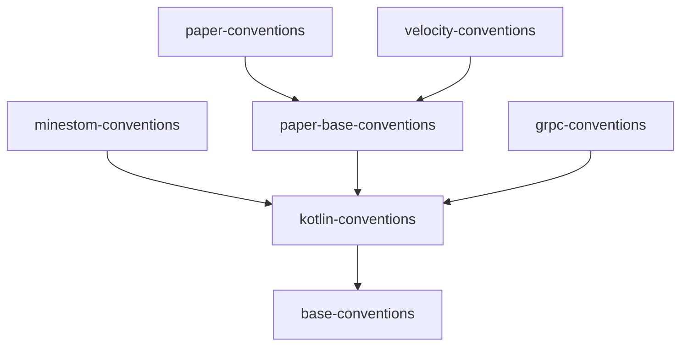

The `library-gradle-plugin` is a Gradle convention plugin bundle that provides standardized build configurations for Grounds projects. It consolidates common setup tasks, dependency management, and build configurations to ensure consistency across all Grounds projects while reducing boilerplate configuration.

## Quick Links

<CardGroup cols={2}>
<Card title="GitHub Repository" icon="github" href="https://github.com/groundsgg/library-gradle-plugin">
  View the source code and contribute to the plugin bundle.
</Card>

<Card title="GitHub Packages" icon="box" href="https://github.com/orgs/groundsgg/packages?repo_name=library-gradle-plugin">
  Browse available plugin versions on GitHub Packages.
</Card>
</CardGroup>

## Getting Started

To get started with the Gradle plugin bundle:

1. [Install the plugins](/tools/gradle-plugin/usage) in your project
2. Apply the base conventions plugin with a version
3. Add the project-specific conventions (Paper, Velocity, Minestom, gRPC) as needed

## Functionality

The plugin bundle consists of convention plugins, each providing specific functionality:

## Plugin Structure

The convention plugins build on each other. Base conventions sit at the bottom, Kotlin conventions add publishing, and the platform-specific conventions layer on top.

### Base Conventions (`gg.grounds.base-conventions`)

- Applies standard plugins (Kotlin JVM, Kapt, Spotless)
- Code formatting with Spotless (ktfmt, Google Style, 4-space indentation)
- Configures Maven Central repository
- Kotlin + Java toolchain configuration (JVM 25, Java 24)
- Group/version defaults with optional `versionOverride` property
- JUnit Platform for tests with full exception output

### Kotlin Conventions (`gg.grounds.kotlin-conventions`)

- Maven publishing to GitHub Packages
- Maven publication naming for root and subprojects

### Paper Base Conventions (`gg.grounds.paper-base-conventions`)

- Adds Paper repository
- Shadow packaging configuration (Fat JAR)
- Disables default `jar` task and wires `shadowJar` into `build`
- Standardized Shadow JAR naming

### Paper Conventions (`gg.grounds.paper-conventions`)

- Paper API dependency (compileOnly)
- Automatic version replacement in `plugin.yml`

### Velocity Conventions (`gg.grounds.velocity-conventions`)

- Optional Velocity API dependencies (compileOnly and kapt)
- Automatic generation of `BuildInfo` class with version for dynamic plugin versioning

### Minestom Conventions (`gg.grounds.minestom-conventions`)

- Minestom dependency
- JVM target attribute pinned to 25 for resolved configurations

### gRPC Conventions (`gg.grounds.grpc-conventions`)

- Protobuf + gRPC dependencies
- Protobuf code generation with gRPC plugin
